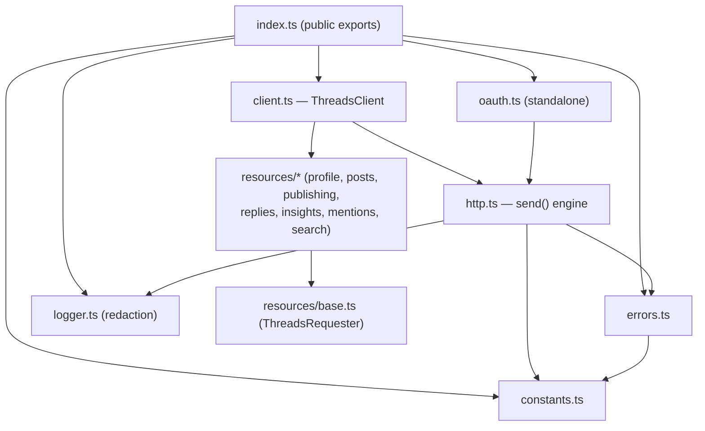
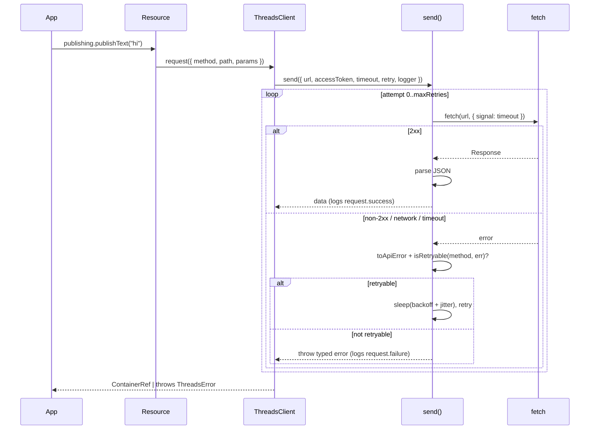
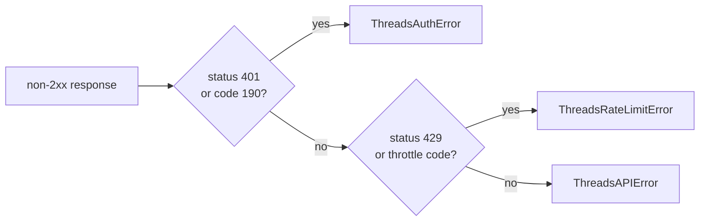

# tredi-sdk — Architecture

How the SDK is put together and why. Read this if you're maintaining the SDK,
reviewing it, or integrating it deeply. For usage see the
[API reference](./api-reference.md) and [guides](./guides.md).

## Design goals

1. **Faithful to the docs** — only documented endpoints, fields, and scopes. No invented surface.
2. **Production-safe by default** — timeouts, retries, and error typing are on out of the box; retries never duplicate a write.
3. **Secure** — tokens and secrets never reach logs.
4. **Lean** — zero runtime dependencies; native `fetch`; no abstraction without a second caller.
5. **Portable** — ESM + CJS, Node 18+/Bun/Deno/edge; `fetch` is injectable.

## Module map

Two things talk to the network — `client.request()` and the `oauth.*`
functions — and both go through the single `send()` engine in `http.ts`.
Resources never touch `fetch`; they only build params and call
`ThreadsRequester.request()`. That narrow interface (defined in
[`resources/base.ts`](../src/resources/base.ts)) keeps the dependency graph
acyclic and makes resources trivial to test.

| File | Responsibility |
|---|---|
| `client.ts` | Config resolution, resource wiring, URL building, escape hatch |
| `http.ts` | Timeout, retry/backoff, request building, response parsing |
| `errors.ts` | Typed error hierarchy + Graph error mapping |
| `logger.ts` | Logger interface + secret redaction |
| `oauth.ts` | Authorization URL + token exchanges (no client needed) |
| `constants.ts` | Hosts, version, defaults, scope list — the only "magic strings" |
| `types.ts` | API response/request types (erased at runtime) |
| `resources/*` | One file per API area; thin param-builders |

## Request lifecycle

- **Timeout** — every attempt runs under an `AbortController` armed with `timeoutMs`. A caller `signal` is linked so external cancellation also works.
- **Token placement** — GET puts `access_token` in the query (Graph requirement); POST puts it in the form **body**, keeping it out of the URL. Either way it's never logged.
- **Parsing** — the body is read as text and JSON-parsed defensively; non-2xx maps to a typed error via `toApiError`.

## Retry & idempotency model

Retries use exponential backoff with **equal jitter** (`delay = cap/2 +
random(0, cap/2)`), capped at `maxDelayMs`, and honor a server `Retry-After`
when present. The retry decision is **method-aware** so a publish is never
duplicated:

| Failure | GET | POST |
|---|---|---|
| Network error (no response) | retry | retry |
| HTTP 429 (rejected before processing) | retry | retry |
| Timeout | retry | **no** |
| HTTP 5xx | retry | **no** |
| HTTP 4xx (except 429) | no | no |

The reasoning: a POST that times out or 5xxes may have already taken effect
(e.g. a published post), so re-sending could create a duplicate. A 429 means the
request was rejected before processing, and a network error means no response was
received — both are safe to retry on any method. This lives in `isRetryable()`
([http.ts](../src/http.ts)) and is unit-tested across the full matrix.

## Error mapping

`toApiError(status, body, headers)` reads the Graph error envelope
(`error.{message,type,code,error_subcode,fbtrace_id}`) and picks the most
specific subtype:

The primary rate-limit signal is HTTP 429; a small set of well-documented Graph
throttle codes (4, 17, 32, 613) act as a secondary signal. Everything else stays
a generic `ThreadsAPIError` with the code exposed, so callers can branch without
the SDK guessing at semantics it can't verify.

## Security model

- **No logging of secrets** — the SDK never calls `console`. It calls the injected `logger`, and the only request field logged is the URL, run through `redactUrl()`. Tokens are appended *inside* `send()` after the logged value is computed, so they cannot leak. A test asserts the token never appears in any log entry.
- **Secrets server-side** — `exchangeCodeForToken` / `exchangeForLongLivedToken` need the app secret; the docstrings and README mark them server-side only.
- **Per-token instances** — a client is bound to one token; `withToken()` returns a fresh instance for another user rather than mutating shared state.
- **At-rest encryption is the host's job** — the SDK holds tokens only in memory; storage/encryption (e.g. Supabase Vault) is left to the application.

## Key decisions & trade-offs

| Decision | Why | Trade-off |
|---|---|---|
| **Zero runtime deps, native `fetch`** | Smallest install, no supply-chain surface, runs everywhere | Requires Node 18+ or an injected `fetch` |
| **Class client with resource namespaces** | Familiar DX (Stripe/Octokit-style), discoverable | The client unit isn't maximally tree-shakeable — mitigated by keeping OAuth/errors/types standalone |
| **Single `send()` engine** | One place for timeout/retry/errors/logging; reused by OAuth | Slightly more plumbing in callers (they build URLs) |
| **Idempotency-aware retries** | Never double-publish | POST 5xx/timeout surface as errors for the caller to handle |
| **Dual ESM + CJS** | Works as a standalone package and as an internal dep in a CJS app | Two output formats to ship |
| **No auto-pagination helper** | YAGNI; cursors are exposed and a 5-line loop covers it | Callers page manually (see guides) |
| **Post deletion omitted** | Exact method/path not confirmed in the docs pass; "don't invent" | Add once verified — flagged in README/CHANGELOG |

## Testing strategy

Tests inject a mock `fetch` (no network, no framework magic — see
[`test/helpers.ts`](../test/helpers.ts)) and assert on the recorded request
shape and the parsed result. Coverage concentrates on the engine (retry,
timeout, error mapping, redaction, request shaping, OAuth, container polling)
rather than thin pass-through resource methods. Run `pnpm test:coverage` for the
current numbers.

## Build & distribution

`tsup` bundles `src/index.ts` to `dist/` as ESM (`index.js`), CJS
(`index.cjs`), and declarations (`index.d.ts` / `index.d.cts`), with source maps
and tree-shaking enabled. `package.json` sets `sideEffects: false` and an
`exports` map so bundlers pick the right format and can drop unused code.
